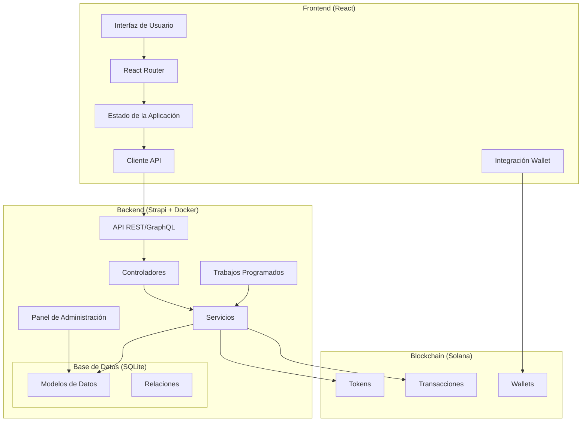
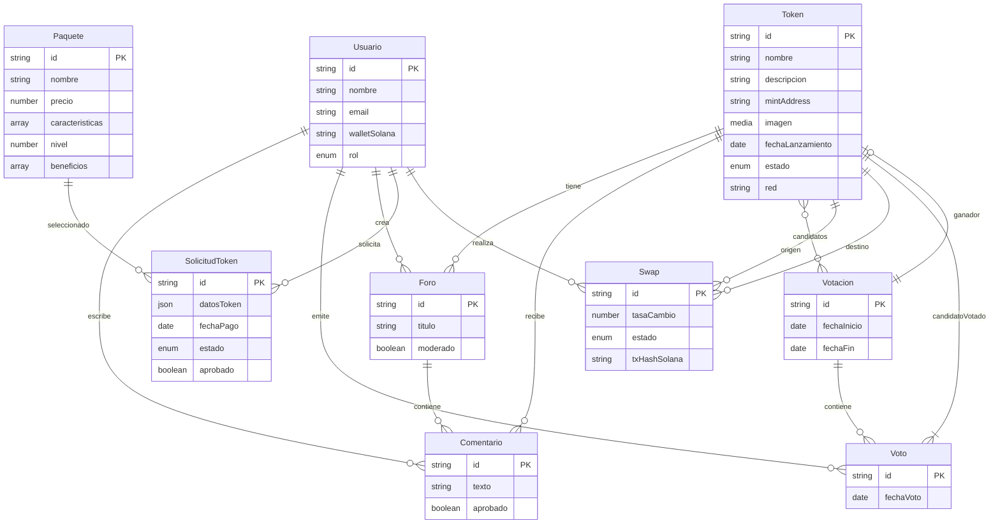

# Diseño de FlorkaFun - Plataforma de Lanzamiento de Tokens Meme

## Overview

FlorkaFun es una plataforma Web3 para el lanzamiento de tokens meme en la red Solana, que combina funcionalidades de votación, gestión de contenido, foros de discusión, y operaciones de swap. La plataforma está diseñada con un enfoque modular, donde cada sección funciona de manera independiente pero integrada dentro del ecosistema completo.

El sistema se compone de dos partes principales:
1. **Frontend**: Una aplicación React (ya desarrollada) que proporciona la interfaz de usuario para todas las funcionalidades.
2. **Backend**: Un sistema CMS basado en Strapi desplegado en Docker que gestiona todos los datos, lógica de negocio, y expone APIs para el frontend.

## Arquitectura

La arquitectura del sistema sigue un patrón de diseño cliente-servidor con una clara separación entre el frontend y el backend:



### Componentes Principales:

1. **Frontend React**:
   - Interfaz de usuario modular con secciones independientes
   - Gestión de estado para datos de la aplicación
   - Cliente API para comunicación con el backend
   - Integración con wallets de Solana

2. **Backend Strapi**:
   - API REST y GraphQL para comunicación con el frontend
   - Panel de administración para gestión de contenido
   - Controladores para lógica de negocio
   - Servicios para operaciones complejas
   - Trabajos programados (CRON) para automatizaciones

3. **Base de Datos SQLite**:
   - Modelos de datos para todas las entidades
   - Relaciones entre entidades

4. **Integración con Solana**:
   - Interacción con tokens en la blockchain
   - Procesamiento de transacciones
   - Conexión con wallets de usuarios

## Componentes y Interfaces

### 1. Sistema de Gestión de Contenido (CMS)

El CMS basado en Strapi será el núcleo del backend, proporcionando:

- **Panel de Administración**: Interfaz para gestionar todos los aspectos de la plataforma
- **API REST y GraphQL**: Endpoints para que el frontend consuma datos
- **Gestión de Usuarios y Permisos**: Control de acceso basado en roles
- **Gestión de Contenido**: Creación y edición de tokens, votaciones, foros, etc.

#### Interfaces del CMS:

```typescript
// Ejemplo de interfaces principales del CMS

interface Token {
  id: string;
  nombre: string;
  descripcion: string;
  mintAddress?: string;
  imagen: MediaFile;
  fechaLanzamiento: Date;
  estado: 'lanzado' | 'próximo' | 'inactivo';
  red: 'solana-mainnet' | 'solana-devnet';
  foros?: Foro[];
  comentarios?: Comentario[];
  votaciones?: Votacion[];
}

interface Votacion {
  id: string;
  fechaInicio: Date;
  fechaFin: Date;
  candidatos: Token[];
  tokenGanador?: Token;
  votos?: Voto[];
}

interface Foro {
  id: string;
  título: string;
  tokenRelacionado: Token;
  creador: Usuario;
  respuestas: Comentario[];
  moderado: boolean;
}

interface Usuario {
  id: string;
  nombre: string;
  email: string;
  walletSolana?: string;
  rol: 'usuario' | 'moderador' | 'admin';
  comentarios?: Comentario[];
  votos?: Voto[];
  solicitudes?: SolicitudToken[];
}

interface Paquete {
  id: string;
  nombre: string;
  precio: number;
  características: string[];
  nivel: number;
  beneficios: string[];
}

interface SolicitudToken {
  id: string;
  usuario: Usuario;
  paquete: Paquete;
  estado: 'pendiente' | 'aprobado' | 'rechazado';
  datosToken: {
    nombre: string;
    descripcion: string;
    imagen?: MediaFile;
  };
  fechaPago?: Date;
  aprobado: boolean;
}

interface Swap {
  id: string;
  tokenOrigen: Token;
  tokenDestino: Token;
  usuario: Usuario;
  tasaCambio: number;
  estado: 'pendiente' | 'completado' | 'fallido';
  txHashSolana?: string;
}

interface Comentario {
  id: string;
  texto: string;
  usuario: Usuario;
  tokenRelacionado?: Token;
  foroRelacionado?: Foro;
  aprobado: boolean;
}

interface Voto {
  id: string;
  usuario: Usuario;
  votacion: Votacion;
  candidatoVotado: Token;
  fechaVoto: Date;
}
```

### 2. API y Comunicación

La comunicación entre el frontend y el backend se realizará a través de APIs REST y GraphQL:

#### API REST:

```
# Ejemplos de endpoints REST

# Tokens
GET /api/tokens - Listar todos los tokens
GET /api/tokens/:id - Obtener un token específico
POST /api/tokens - Crear un nuevo token (admin)
PUT /api/tokens/:id - Actualizar un token (admin)

# Votaciones
GET /api/votaciones - Listar votaciones activas
GET /api/votaciones/:id - Obtener una votación específica
POST /api/votaciones/:id/votar - Emitir un voto

# Foros
GET /api/foros - Listar foros
GET /api/foros/:id - Obtener un foro específico
POST /api/foros - Crear un nuevo foro (moderador/admin)
POST /api/foros/:id/comentarios - Añadir comentario a un foro

# Usuarios
GET /api/usuarios/me - Obtener perfil del usuario actual
PUT /api/usuarios/me - Actualizar perfil del usuario actual
POST /api/auth/local/register - Registrar nuevo usuario
POST /api/auth/local - Iniciar sesión

# Paquetes
GET /api/paquetes - Listar paquetes disponibles

# Solicitudes
POST /api/solicitudes - Crear una nueva solicitud de token
GET /api/solicitudes/me - Listar solicitudes del usuario actual

# Swaps
GET /api/swaps - Listar operaciones de swap
POST /api/swaps - Crear una nueva operación de swap
```

#### GraphQL:

```graphql
# Ejemplos de queries y mutations GraphQL

# Queries
query GetTokens {
  tokens(filters: { estado: { eq: "lanzado" } }) {
    data {
      id
      attributes {
        nombre
        descripcion
        imagen {
          data {
            attributes {
              url
            }
          }
        }
        mintAddress
        fechaLanzamiento
      }
    }
  }
}

query GetVotacionesActivas {
  votaciones(filters: { fechaFin: { gt: "now" } }) {
    data {
      id
      attributes {
        fechaInicio
        fechaFin
        candidatos {
          data {
            id
            attributes {
              nombre
              imagen {
                data {
                  attributes {
                    url
                  }
                }
              }
            }
          }
        }
      }
    }
  }
}

# Mutations
mutation EmitirVoto($votacionId: ID!, $candidatoId: ID!) {
  createVoto(data: {
    votacion: $votacionId,
    candidatoVotado: $candidatoId,
    usuario: "me"
  }) {
    data {
      id
    }
  }
}

mutation CrearSolicitudToken($paqueteId: ID!, $datos: SolicitudTokenInput!) {
  createSolicitudToken(data: {
    paquete: $paqueteId,
    usuario: "me",
    datosToken: $datos,
    estado: "pendiente",
    aprobado: false
  }) {
    data {
      id
    }
  }
}
```

### 3. Automatizaciones y CRON Jobs

El sistema implementará varios trabajos programados para automatizar procesos clave:

1. **Finalización de Votaciones**:
   - Ejecutado diariamente
   - Verifica votaciones que han finalizado
   - Determina el token ganador
   - Crea una entrada en "Next" con el token ganador
   - Programa la fecha de lanzamiento (próximo viernes)

2. **Lanzamiento de Tokens**:
   - Ejecutado diariamente
   - Verifica tokens programados para lanzamiento en la fecha actual
   - Cambia el estado de "próximo" a "lanzado"
   - Mueve el token a la sección Home
   - Envía notificaciones a usuarios interesados

3. **Notificaciones**:
   - Ejecutado periódicamente
   - Envía notificaciones por eventos importantes:
     - Aprobación de solicitudes de token
     - Lanzamiento de tokens votados por el usuario
     - Finalización exitosa de operaciones de swap

### 4. Roles y Permisos

El sistema implementará tres niveles de roles con permisos específicos:

1. **Usuario Estándar**:
   - Votar en votaciones activas (una vez por votación)
   - Comentar en foros existentes
   - Reaccionar con emojis a comentarios
   - Enviar solicitudes de creación de token
   - Pagar paquetes de creación de token
   - Realizar operaciones de swap
   - Ver su perfil y actualizar información personal
   - Conectar wallet de Solana

2. **Moderador**:
   - Todas las acciones de Usuario Estándar
   - Crear nuevos hilos en foros
   - Moderar contenido (aprobar/rechazar comentarios)
   - Banear/bloquear usuarios en foros
   - Anular reacciones inapropiadas
   - Administrar usuarios dentro del foro

3. **Administrador**:
   - Control total de la plataforma
   - Crear/editar/eliminar tokens
   - Crear/editar/eliminar votaciones
   - Aprobar/rechazar solicitudes de token
   - Programar fechas de lanzamiento
   - Gestionar roles de usuarios
   - Acceder a estadísticas y métricas
   - Configurar parámetros del sistema

### 5. Integración con Blockchain de Solana

La plataforma se integrará con la blockchain de Solana para:

1. **Creación de Tokens**:
   - Interfaz para configurar parámetros del token
   - Generación de metadatos según estándares de Solana
   - Creación del token en la blockchain
   - Verificación y registro de la transacción

2. **Operaciones de Swap**:
   - Interfaz para seleccionar tokens y cantidades
   - Cálculo de tasas de cambio y comisiones
   - Ejecución de la transacción en la blockchain
   - Registro y seguimiento de la operación

3. **Verificación de Wallets**:
   - Conexión con wallets como Phantom
   - Verificación de propiedad de wallet
   - Firma de mensajes para autenticación

4. **Exploración de Tokens**:
   - Enlaces a exploradores de Solana
   - Visualización de datos on-chain
   - Seguimiento de actividad del token

## Data Models

### Estructura de la Base de Datos

La base de datos SQLite contendrá las siguientes colecciones principales con sus relaciones:



## Error Handling

El sistema implementará una estrategia de manejo de errores en múltiples niveles:

### 1. Errores de API

- **Códigos HTTP estándar**: 400 (Bad Request), 401 (Unauthorized), 403 (Forbidden), 404 (Not Found), 500 (Internal Server Error)
- **Respuestas estructuradas**: Todas las respuestas de error incluirán:
  ```json
  {
    "error": true,
    "code": "ERROR_CODE",
    "message": "Descripción del error",
    "details": { /* Información adicional */ }
  }
  ```

### 2. Errores de Blockchain

- **Manejo de fallos en transacciones**: Captura y registro de errores en operaciones con la blockchain
- **Reintentos automáticos**: Para errores transitorios en la red
- **Notificaciones al usuario**: Información clara sobre el estado de las transacciones

### 3. Errores de Validación

- **Validación en frontend**: Prevenir envío de datos inválidos
- **Validación en backend**: Asegurar integridad de datos antes de procesamiento
- **Mensajes de error específicos**: Indicar exactamente qué campo y qué regla se ha violado

### 4. Logging y Monitoreo

- **Registro detallado**: Todos los errores se registrarán con contexto completo
- **Alertas**: Errores críticos generarán alertas para el equipo técnico
- **Dashboard de monitoreo**: Visualización de errores y problemas recurrentes

## Testing Strategy

La estrategia de pruebas abarcará múltiples niveles para garantizar la calidad del sistema:

### 1. Pruebas Unitarias

- **Backend**: Pruebas de servicios, controladores y modelos individuales
- **Frontend**: Pruebas de componentes React aislados
- **Cobertura objetivo**: >80% del código crítico

### 2. Pruebas de Integración

- **API**: Verificación de endpoints y respuestas correctas
- **Flujos de datos**: Pruebas de integración entre diferentes servicios
- **Base de datos**: Verificación de operaciones CRUD y relaciones

### 3. Pruebas End-to-End

- **Flujos de usuario**: Simulación de acciones completas de usuario
- **Escenarios críticos**: Votación, creación de token, operaciones de swap
- **Automatización**: Uso de herramientas como Cypress para pruebas automatizadas

### 4. Pruebas de Blockchain

- **Entorno de prueba**: Uso de Solana Devnet para pruebas de integración
- **Simulación de transacciones**: Verificación de creación de tokens y operaciones
- **Manejo de errores**: Pruebas de escenarios de fallo en la blockchain

### 5. Pruebas de Seguridad

- **Autenticación y autorización**: Verificación de control de acceso
- **Protección de datos**: Pruebas de exposición de información sensible
- **Inyección y XSS**: Pruebas de vulnerabilidades comunes

### 6. Pruebas de Rendimiento

- **Carga**: Comportamiento bajo número elevado de usuarios concurrentes
- **Estrés**: Límites del sistema antes de degradación
- **Escalabilidad**: Verificación de capacidad de crecimiento

## Consideraciones de Seguridad

### 1. Autenticación y Autorización

- **JWT**: Uso de tokens JWT para autenticación
- **Refresh Tokens**: Implementación de tokens de actualización para sesiones prolongadas
- **Verificación de roles**: Control estricto de acceso basado en roles

### 2. Protección de Datos

- **Encriptación**: Datos sensibles encriptados en reposo
- **HTTPS**: Toda comunicación a través de conexiones seguras
- **Sanitización**: Limpieza de inputs para prevenir inyecciones

### 3. Seguridad Blockchain

- **Firmas**: Verificación de firmas para operaciones blockchain
- **Límites de transacción**: Protecciones contra operaciones excesivas
- **Monitoreo**: Detección de actividades sospechosas

### 4. Protección contra Ataques Comunes

- **Rate Limiting**: Prevención de ataques de fuerza bruta
- **CSRF Protection**: Tokens anti-CSRF en formularios
- **XSS Prevention**: Escape de contenido generado por usuarios

## Despliegue y DevOps

### 1. Entorno Docker

- **docker-compose.yml**: Configuración para desarrollo y producción
- **Contenedores**: Strapi, SQLite, servicios adicionales según necesidad
- **Volúmenes**: Persistencia de datos entre reinicios

### 2. CI/CD

- **Pipeline**: Integración y despliegue automatizados
- **Entornos**: Desarrollo, Staging, Producción
- **Pruebas automatizadas**: Ejecución de pruebas en cada push

### 3. Monitoreo

- **Logs**: Sistema centralizado de logs
- **Métricas**: Seguimiento de rendimiento y uso
- **Alertas**: Notificaciones sobre problemas críticos

### 4. Backups

- **Base de datos**: Respaldos regulares automatizados
- **Contenido**: Backup de archivos y medios
- **Restauración**: Procedimientos documentados para recuperación## Prin
cipios de trabajo para Kiro AI

1. **No modificar ningún diseño de frontend (React o Figma exportado) sin consentimiento explícito del dueño del proyecto.**

2. **Tratar cada página (Home, Next, Votaciones, Foros) como sistemas independientes. Ningún cambio en una sección debe afectar otra sin autorización previa.**

3. **Mantener las colecciones de contenido en el CMS como fuentes únicas de verdad.**

4. **No agregar, eliminar o renombrar campos, endpoints o lógicas de negocio sin validación humana.**

5. **Antes de ejecutar operaciones sensibles (como borrar datos, migrar base de datos, reestructurar entidades), solicitar siempre aprobación.**